# laravel 8 quiz app with jetstream inertia

run the following commands:

    composer install
    
    npm install
    
    php artisan serve
    
    npm run watch

    php artisan db:seed

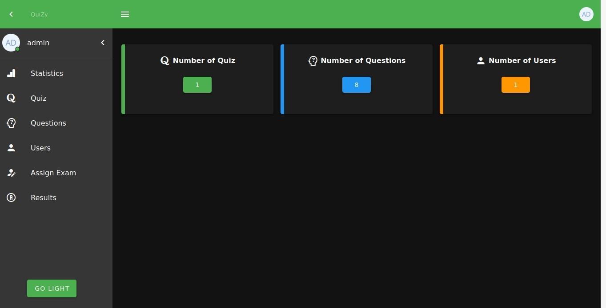

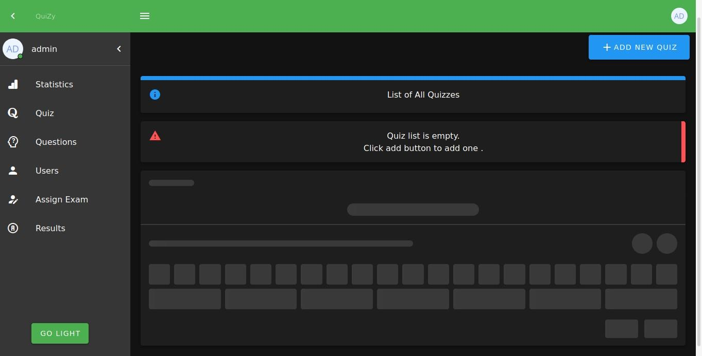

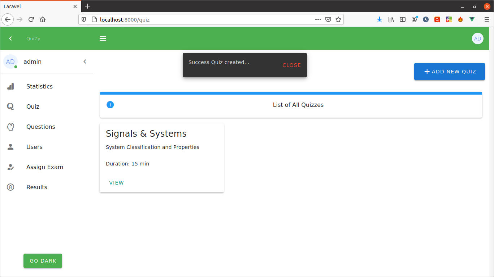

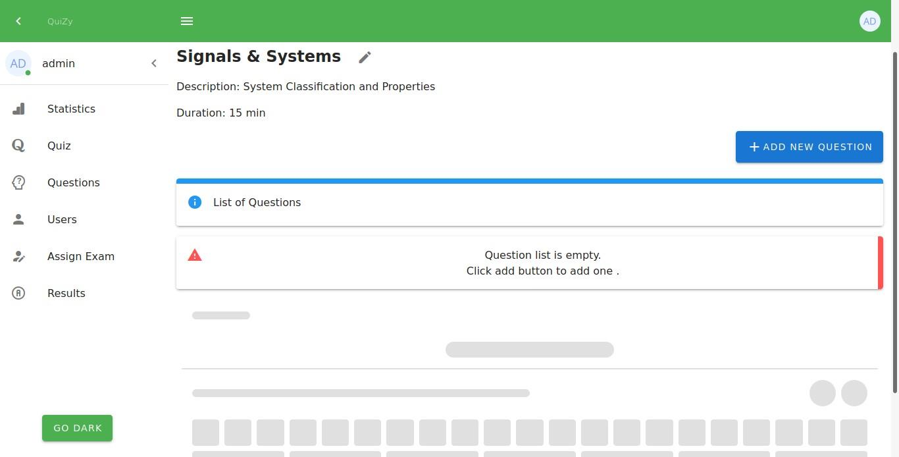

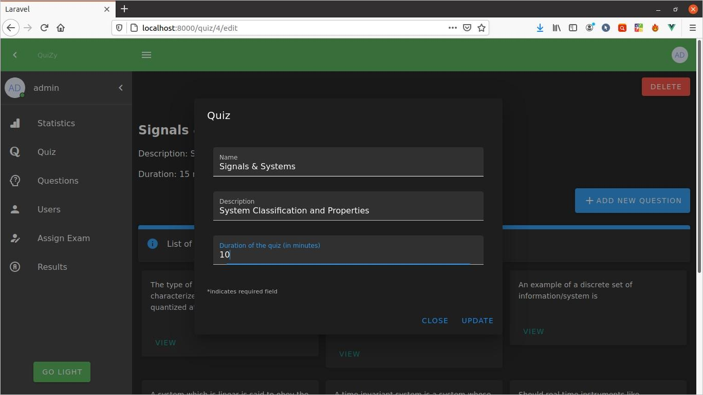

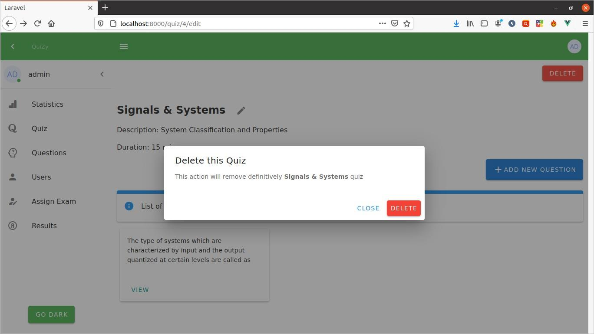

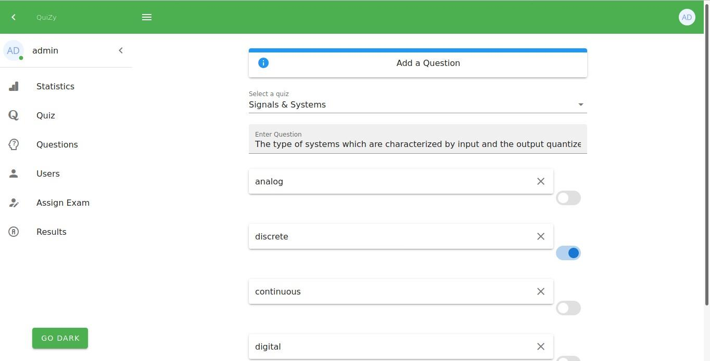

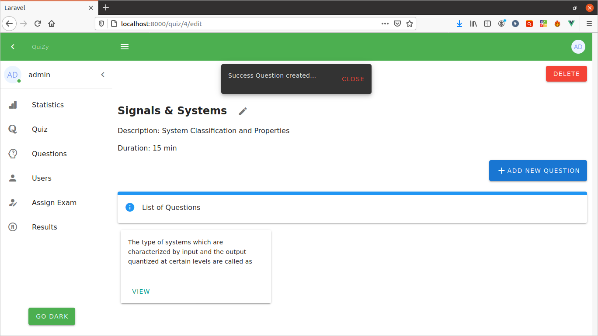

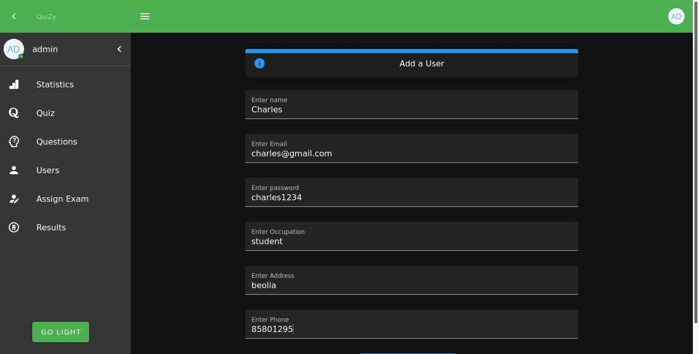

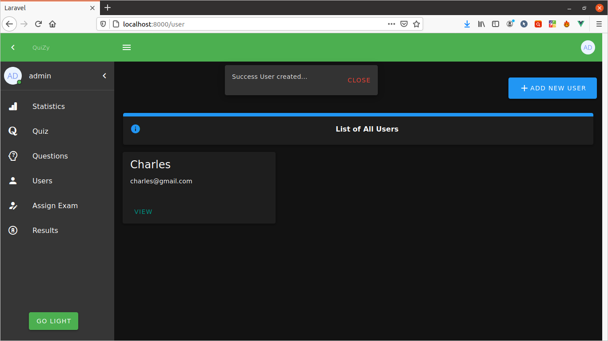

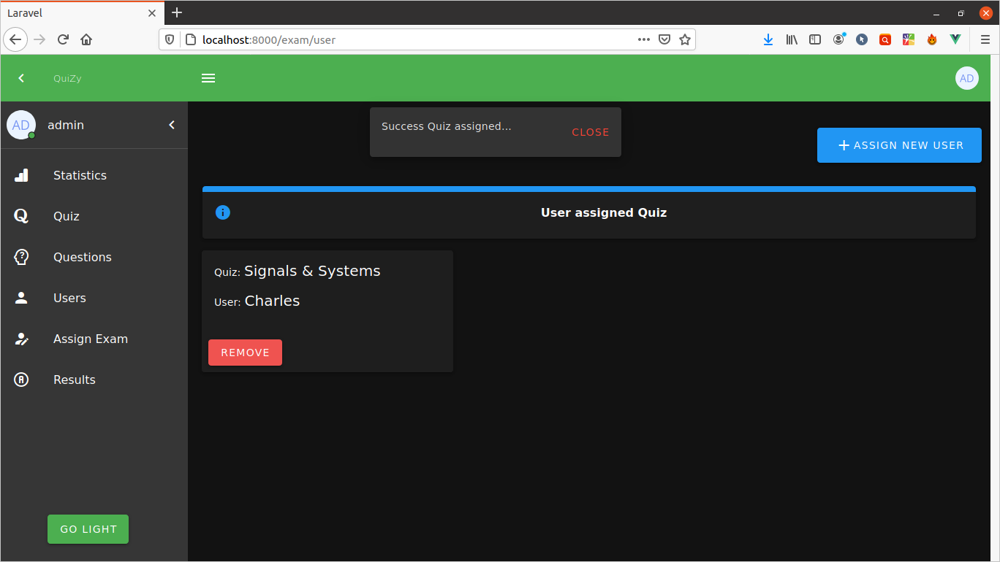

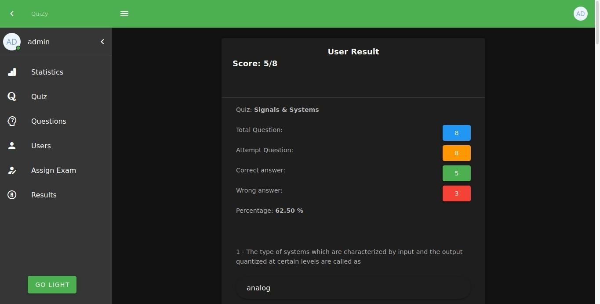
